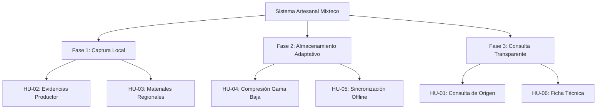

# Mapa Conceptual y Alineación del Backlog

```mermaid
graph TD
    A[Sistema Artesanal Mixteco] --> B[Fase 1: Captura Local]
    A --> C[Fase 2: Almacenamiento Adaptativo]
    A --> D[Fase 3: Consulta Transparente]

    B --> HU2[HU-02: Evidencias Productor]
    B --> HU3[HU-03: Materiales Regionales]

    C --> HU4[HU-04: Compresión Gama Baja]
    C --> HU5[HU-05: Sincronización Offline]

    D --> HU1[HU-01: Consulta de Origen]
    D --> HU6[HU-06: Ficha Técnica]
```
